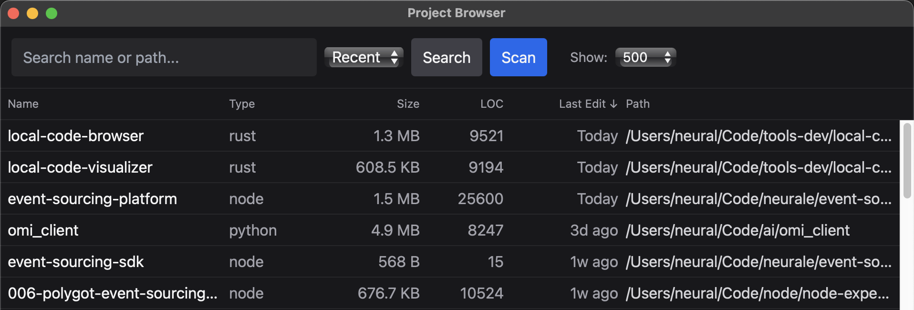

# Local Code Browser

A powerful desktop application for browsing, analyzing, and managing your local code projects. Built with Tauri (Rust + React) for fast performance and native desktop integration.




## Table of Contents

- [Local Code Browser](#local-code-browser)
  - [Table of Contents](#table-of-contents)
  - [Features](#features)
    - [🔍 **Project Discovery \& Analysis**](#-project-discovery--analysis)
    - [📊 **Interactive Project Browser**](#-interactive-project-browser)
    - [🚀 **Editor Integration**](#-editor-integration)
    - [💫 **Modern UI/UX**](#-modern-uiux)
  - [Installation](#installation)
    - [🚀 **Option 1: Pre-built Releases (Recommended)**](#-option-1-pre-built-releases-recommended)
    - [🛠️ **Option 2: Development Build**](#️-option-2-development-build)
    - [Prerequisites](#prerequisites)
  - [🚀 Quickstart](#-quickstart)
    - [🔧 **Option 3: CI/CD Pipeline \& Automated Releases**](#-option-3-cicd-pipeline--automated-releases)
      - [**Automated Release Process**](#automated-release-process)
      - [**CI/CD Configuration**](#cicd-configuration)
      - [**Manual Release Build**](#manual-release-build)
      - [**Release Script**](#release-script)
  - [Usage](#usage)
    - [🖥️ **Desktop Application**](#️-desktop-application)
    - [🖱️ **CLI Interface**](#️-cli-interface)
    - [⚙️ **Configuration**](#️-configuration)
      - [**Config File Location**](#config-file-location)
      - [**Configuration Options**](#configuration-options)
      - [**Ignore Precedence**](#ignore-precedence)
      - [**Configuration Commands**](#configuration-commands)
      - [**Project Detection**](#project-detection)
  - [Development](#development)
    - [🔄 **CI/CD Workflows**](#-cicd-workflows)
      - [**Pull Request Validation** (`.github/workflows/ci.yml`)](#pull-request-validation-githubworkflowsciyml)
      - [**Automated Releases** (`.github/workflows/release.yml`)](#automated-releases-githubworkflowsreleaseyml)
    - [🛠️ **Available Commands**](#️-available-commands)
    - [📁 **Project Structure**](#-project-structure)
    - [🔧 **Architecture**](#-architecture)
      - [**Workspace Structure**](#workspace-structure)
      - [**Feature Flags**](#feature-flags)
      - [**Technology Stack**](#technology-stack)
      - [**Key Dependencies**](#key-dependencies)
  - [Troubleshooting](#troubleshooting)
    - [Editor Integration Issues](#editor-integration-issues)
    - [Performance Tips](#performance-tips)
  - [Contributing](#contributing)
    - [**Creating Releases**](#creating-releases)
    - [**Development Workflow**](#development-workflow)
  - [License](#license)


## Features

### 🔍 **Project Discovery & Analysis**
- **Automatic scanning** of your code directories
- **Multi-language support** (Python, Node.js, Rust, Java, Go, .NET, etc.)
- **Lines of Code (LOC) analysis** with tokei integration
- **File size and project metrics** tracking
- **Git repository detection** and metadata

### 📊 **Interactive Project Browser**
- **Sortable columns** with ascending/descending order
- **Real-time search** and filtering
- **Pagination** with customizable page sizes (100, 250, 500, 1000)
- **Total project count** display
- **Last edit date** tracking with human-readable formatting

### 🚀 **Editor Integration**
- **One-click project opening** in your favorite editors
- **Windsurf integration** (`windsurf <path>`)
- **Cursor integration** (`cursor <path>`)
- **Fallback to clipboard** if editor not found

### 💫 **Modern UI/UX**
- **Professional dark theme** with zinc color palette
- **Responsive layout** with fixed header/footer
- **Loading indicators** with animated spinners
- **Human-readable file sizes** (B, KB, MB, GB, TB)
- **Relative date formatting** (Today, Yesterday, 3d ago, etc.)

## Installation

Choose from multiple installation methods:

### 🚀 **Option 1: Pre-built Releases (Recommended)**

Download the latest release from GitHub for your platform:

- **[Download for macOS](https://github.com/NeuralEmpowerment/local-code-browser/releases/download/v0.1.4/Project.Browser_0.1.4_aarch64.dmg)**
- **[Download for Windows](https://github.com/NeuralEmpowerment/local-code-browser/releases/download/v0.1.4/Project.Browser_0.1.4_x86_64.msi)**
- **[Download for Linux](https://github.com/NeuralEmpowerment/local-code-browser/releases/download/v0.1.4/Project.Browser_0.1.4_amd64.deb)**

**Installation Steps:**
1. Download the appropriate file for your operating system
2. **macOS**: Open the `.dmg` file and drag `Project Browser.app` to your Applications folder
3. **Windows**: Run the `.msi` installer
4. **Linux**: Install the `.deb` package with your package manager
5. Launch the application from your applications menu or desktop

### 🛠️ **Option 2: Development Build**

Perfect for developers who want to contribute or customize the application.

### Prerequisites
- **Rust** (latest stable)
- **Node.js** (v16+)
- **npm** or **yarn**

## 🚀 Quickstart

Get up and running in just three commands:

```bash
# Clone the repository
git clone https://github.com/NeuralEmpowerment/local-code-browser.git
cd local-code-browser

# 1. Setup development environment
make setup

# 2. Build the application
make build

# 3. Run the application
make run
```

That's it! The application will launch with all analysis features enabled.

### 🔧 **Option 3: CI/CD Pipeline & Automated Releases**

This project includes automated building and releases via GitHub Actions.

#### **Automated Release Process**

When a new version tag is pushed to the repository:

```bash
# Create and push a new version tag
git tag v0.1.5
git push origin v0.1.5
```

The CI/CD pipeline will automatically:
1. **Build** the application for macOS, Windows, and Linux
2. **Create** platform-specific installers (`.dmg`, `.msi`, `.deb`)
3. **Sign** the applications with proper certificates
4. **Upload** release assets to GitHub Releases
5. **Generate** checksums for security verification

#### **CI/CD Configuration**

The build pipeline (`.github/workflows/release.yml`) handles:

- **Multi-platform builds** using GitHub Actions runners
- **Code signing** with platform-specific certificates
- **Automated testing** before release
- **Release notes** generation
- **Asset upload** to GitHub Releases

#### **Manual Release Build**

To build releases locally:

```bash
# Build for current platform
cargo tauri build --release

# Build for all platforms (requires cross-compilation setup)
cargo tauri build --release --target all
```

#### **Release Script**

Use the automated release script for easy version management:

```bash
# Make executable and run
chmod +x scripts/release.sh
./scripts/release.sh

# Follow the prompts to create a new version release
# This will update versions, commit, tag, and trigger CI/CD
```

## Usage

### 🖥️ **Desktop Application**

1. **Launch the app**:
   ```bash
   make tauri-run-analyzed
   ```

2. **Scan your projects**:
   - Click the **"Scan"** button to discover projects
   - Default scan location: `$HOME/Code`
   - Scans recursively for project files

3. **Browse and sort**:
   - Click any **column header** to sort (Name, Type, Size, LOC, Last Edit)
   - Click again to **reverse sort direction**
   - Use the **search box** to filter projects

4. **Adjust view**:
   - Select **page size** (100, 250, 500, 1000 items)
   - Navigate with **Previous/Next** buttons
   - View **total project count** in footer

5. **Open projects**:
   - Click any **project path** to open "Open In..." modal
   - Choose **Windsurf** or **Cursor** to launch editor
   - Project opens directly in your chosen editor

### 🖱️ **CLI Interface**

```bash
# Scan projects
make run-scan

# List projects (basic)
make run-list

# List projects with analysis
make run-list-analyzed

# Show database path
make db-path

# Run full QA pipeline
make qa
```

**Advanced CLI Options:**

```bash
# Scan with custom roots
cargo run -p cli -- scan --root /path/to/projects --root /another/path

# Dry run (preview without writing to DB)
cargo run -p cli -- scan --dry-run

# List with JSON output
cargo run -p cli -- list --json --limit 100

# List with different sort options
cargo run -p cli -- list --sort name --limit 50
cargo run -p cli -- list --sort recent --limit 20
cargo run -p cli -- list --sort loc --limit 100 --show-loc

# Configuration commands
cargo run -p cli -- config --print          # Show effective config
cargo run -p cli -- config --db-path        # Show database path
```

### ⚙️ **Configuration**

#### **Config File Location**

Default configuration is stored at:
- **macOS**: `~/Library/Application Support/ProjectBrowser/config.json`

#### **Configuration Options**

```json
{
  "roots": ["~/Code"],                    // Directories to scan
  "global_ignores": [                      // Additional ignore patterns
    ".git", "node_modules", "target", 
    "build", "dist", ".venv", "Pods", 
    "DerivedData", ".cache"
  ],
  "size_mode": "exact_cached",           // File size calculation mode
  "concurrency": 8,                       // Worker tasks count
  "git.use_cli_fallback": false           // Use git CLI if git2 fails
}
```

#### **Ignore Precedence**

The scanner follows this precedence for ignore patterns:
1. **Repository .gitignore** files
2. **App global_ignores** configuration
3. **User ignore files** (if present):
   - `~/Library/Application Support/ProjectBrowser/ignore`
   - `~/.config/project-browser/ignore` (legacy)

#### **Configuration Commands**

```bash
# Show effective configuration
cargo run -p cli -- config --print

# Show database path
cargo run -p cli -- config --db-path

# Preview scan without writing to database
cargo run -p cli -- scan --dry-run
```

#### **Project Detection**

The scanner automatically detects projects by looking for these files:
- **Python projects**: `pyproject.toml`, `requirements.txt`
- **Node.js projects**: `package.json`
- **Rust projects**: `Cargo.toml`
- **Java projects**: `pom.xml`, `build.gradle`, `gradlew`
- **Go projects**: `go.mod`
- **.NET projects**: `global.json`, `*.csproj`
- **Git repositories**: `.git` directories

## Development

### 🔄 **CI/CD Workflows**

This project includes automated testing and release workflows:

#### **Pull Request Validation** (`.github/workflows/ci.yml`)
- **Code formatting** checks with `cargo fmt`
- **Linting** with `cargo clippy`
- **Testing** with `cargo test`
- **Frontend linting** and testing
- **Multi-platform builds** for macOS, Linux, and Windows

#### **Automated Releases** (`.github/workflows/release.yml`)
- **Triggered** on version tags (e.g., `v1.2.3`)
- **Multi-platform builds** for distribution
- **Automatic uploads** to GitHub Releases
- **Release notes** generation

### 🛠️ **Available Commands**

```bash
# Development
make setup          # Install Rust components
make build          # Build the workspace
make qa             # Run full QA pipeline

# Desktop App
make tauri-run              # Run Tauri app
make tauri-run-analyzed     # Run with analysis features

# Web Frontend
make web-dev        # Start development server
make web-build      # Build for production
make web-preview    # Preview built frontend

# CLI Tools
make run-scan       # Scan projects
make run-list       # List projects
make run-scan-analyzed      # Scan with analysis
make run-list-analyzed      # List with LOC info

# Code Quality
make fmt            # Check formatting
make fmt-fix        # Auto-format code
make lint           # Run clippy linter
make test           # Run tests
make clean          # Clean build artifacts
```

### 📁 **Project Structure**

```
local-code-browser/
├── src-tauri/              # Tauri backend (Rust)
│   ├── src/main.rs         # Main application logic
│   ├── Cargo.toml          # Rust dependencies
│   └── tauri.conf.json     # Tauri configuration
├── web/                    # Frontend (React + TypeScript)
│   ├── src/ui/App.tsx      # Main UI component
│   ├── package.json        # Node.js dependencies
│   └── vite.config.ts      # Vite configuration
├── crates/
│   ├── indexer/            # Core indexing logic
│   └── cli/                # Command-line interface
├── Makefile                # Build automation
└── README.md               # This file
```

### 🔧 **Architecture**

#### **Workspace Structure**

The project uses a **Cargo workspace** structure for better code organization:

```
local-code-browser/
├── Cargo.toml              # Workspace definition
├── crates/                 # Rust crates
│   ├── indexer/           # Core indexing logic
│   │   ├── lib.rs         # Main library interface
│   │   ├── scan.rs        # Directory scanning
│   │   ├── db.rs          # Database operations
│   │   ├── detect.rs      # Project type detection
│   │   ├── config.rs      # Configuration management
│   │   ├── vcs.rs         # Version control (git)
│   │   └── analyzers.rs   # Code analysis (LOC)
│   └── cli/               # Command-line interface
│       └── main.rs        # CLI entry point
├── src-tauri/             # Tauri desktop app
│   ├── src/main.rs        # Tauri backend
│   └── Cargo.toml         # Tauri dependencies
├── web/                   # Frontend (React + TypeScript)
│   ├── src/ui/App.tsx     # Main UI component
│   └── package.json       # Node.js dependencies
└── Makefile               # Build automation
```

#### **Feature Flags**

The application supports **optional features** for conditional compilation:

- **`git`**: Enables Git repository detection and metadata
  - Adds `git2` dependency
  - Enables `vcs` module in indexer
  - Provides git status information

- **`analyzers`**: Enables code analysis features
  - Adds `tokei` dependency for Lines of Code counting
  - Enables `analyzers` module in indexer
  - Provides per-language LOC breakdowns

#### **Technology Stack**

- **Backend**: Rust with Tauri v2 for native desktop integration
- **Frontend**: React 18 with TypeScript and Tailwind CSS
- **Database**: SQLite with Rusqlite for project metadata storage
- **Analysis**: Tokei v12 for lines of code counting (optional)
- **Build**: Vite for fast frontend bundling
- **UI Components**: React Window for virtualized scrolling
- **Styling**: Tailwind CSS with zinc color palette

#### **Key Dependencies**

```toml
# Core
anyhow = "1"          # Error handling
serde = { version = "1", features = ["derive"] }  # Serialization
tracing = "0.1"       # Structured logging

# Database
rusqlite = "0.31"     # SQLite with bundled version

# Optional features
git2 = "0.18"         # Git integration (optional)
tokei = "12"          # Code analysis (optional)

# Frontend
react = "^18.3.1"     # UI framework
tauri = "^2.0.0"      # Desktop framework
```

## Troubleshooting

### Editor Integration Issues

If **Windsurf** or **Cursor** don't open:

1. **Check if editor is installed**:
   ```bash
   which windsurf
   which cursor
   ```

2. **Add to PATH** if needed:
   ```bash
   # For Windsurf
   export PATH="/Applications/Windsurf.app/Contents/Resources/app/bin:$PATH"
   
   # For Cursor
   export PATH="/Applications/Cursor.app/Contents/Resources/app/bin:$PATH"
   ```

3. **Fallback**: Commands are copied to clipboard if editor not found

### Performance Tips

- Use **page size 500** (default) for best performance
- **Scan periodically** to keep project data fresh
- Use **search/filter** for large project collections

## Contributing

### **Creating Releases**

To create a new release:

1. **Update version** in all relevant files (use the release script)
2. **Test thoroughly** with `make qa`
3. **Create a pull request** for the version bump
4. **After merging**, create a version tag to trigger automated release:

```bash
git tag v1.2.3
git push origin v1.2.3
```

The CI/CD pipeline will automatically build and publish releases to GitHub.

### **Development Workflow**

1. Fork the repository
2. Create a feature branch
3. Run `make qa` to ensure code quality
4. Submit a pull request

## License

[MIT](./LICENSE)

---

**Built with ❤️ using Tauri, Rust, and React**